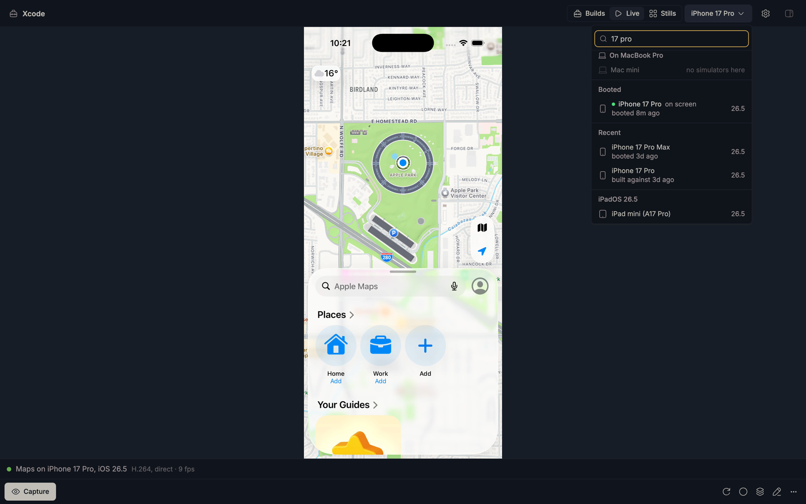
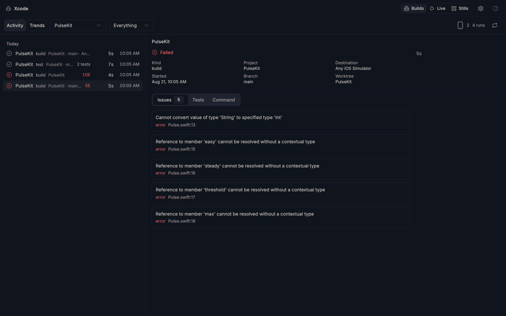
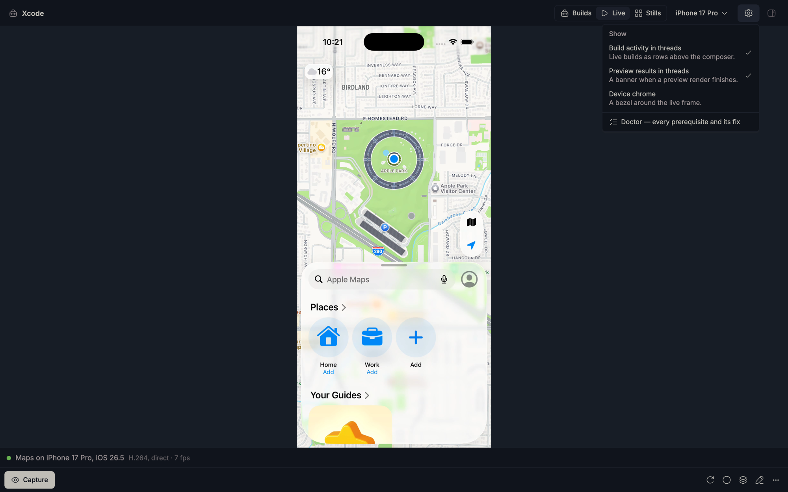

# Xcode for bb

**Every Xcode build on your machine, tracked live with zero configuration —
and the simulators they run on, streamed and fully touchable, right in your
[bb](https://getbb.app) sidebar.**



```sh
bb plugin install vburojevic/bb-plugin-xcode
```

## One panel, three tabs

### Builds

Start a build anywhere — Xcode, `xcodebuild`, an agent, a CI script wrapping
either — and it appears within seconds: live progress while it runs, then the
verdict, errors and failed tests with `file:line`, per-project history, and
trends. Nothing to configure; the tracker learns DerivedData roots from the
builds themselves.



### Live

A booted simulator, streamed over hardware H.264 and fully interactive: tap,
drag, flick, long-press, trackpad pinch, ⌘V paste, keyboard. Input ships as
timestamped batches and is replayed at the finger's own pace, so a flick keeps
its momentum even over a remote bb connection.

The device picker shelves what matters: **Booted** first (live dot, an
*on screen* marker), then **Recent** — last booted *or* last targeted by one
of your tracked builds, evidence Xcode's own picker does not have — then
everything else grouped by runtime, searchable the moment the herd grows. It
also names the machine the simulators live on. Hover a row for the UDID your
next `-destination` wants.

### Stills

Every SwiftUI preview in the project, rendered on a real simulator and diffed
against the last run — a visual regression net that reports itself in the
panel and, when you want it to, as a banner in the thread that changed the
code.

### The gear

Quick toggles for what the plugin shows in threads — build activity above the
composer, preview-result banners, device chrome — plus the doctor, which lists
every prerequisite and its fix. Trust-shaped settings (like whether agents may
see simulator frames at all) deliberately live only in bb's own settings
screen; the [security model](SECURITY.md) explains why the gear cannot touch
them.



A per-thread simulator also opens beside any conversation ("Open simulator"),
picking its device from what that thread has actually been building — and
saying why it picked it.

## Why it needs no configuration

DerivedData is not knowable in advance. It may be the shared
`~/Library/Developer/Xcode/DerivedData`, a project-local `.build-sim` nested
inside an SPM subpackage, or anything handed to `-derivedDataPath`. So the
plugin never asks where to look — it **learns roots from the running builds**.

Every compiler invocation embeds its DerivedData root in its own arguments:

```
<ROOT>/Build/Intermediates.noindex/App.build/Debug/App.build/Objects-normal/…
```

Matching `^(.*?)/Build/(Intermediates\.noindex|Products)/` recovers `<ROOT>`
from any build — Xcode.app, `xcodebuild`, `xcodebuildmcp`, CI scripts, anything.
Discovered roots are persisted and watched from then on.

## The capture ladder

Each tier works alone and degrades gracefully.

| Tier | Source | Gives you | Needs |
|---|---|---|---|
| 0 | `ps` + `lsof -d cwd` | what is running now, scheme, action, destination, cwd, duration | nothing |
| 1 | `LogStoreManifest.plist` | completed runs, status, error/warning counts | nothing |
| 2 | `.xcresult` via `xcresulttool` | pass/fail, issues with file:line, per-test results | a result bundle |
| 3 | `-resultStreamPath` | live per-section progress, issues as they occur | `bb xcode run` |

## Getting real pass/fail: `bb xcode shim`

**Xcode writes no Build-domain log entry for command-line builds.** Measured
here: every DerivedData root on the machine had *zero* Build entries — only
`Package` ("Resolve Packages") entries. So Tier 1, which is how Spotify's
XCMetrics collects builds, yields nothing for a `xcodebuild`-driven workflow.
A run's outcome is only recoverable from a `.xcresult`, and only when one was
requested.

Without help the tracker can therefore time a build precisely but must report
its outcome as **Finished** rather than guessing green. To fix that everywhere:

```sh
bb xcode shim install     # confirm in bb, then add the printed PATH line
```

The shim is a ~30-line POSIX `sh` script that adds `-resultBundlePath` to
build/test invocations lacking one and `exec`s the real `/usr/bin/xcodebuild`.
Queries (`-version`, `-list`, `-showBuildSettings`) pass through untouched, as
does anything that already sets a bundle path. It has no dependency on bb, node,
or the network, and any unexpected condition falls through to the real tool —
it must never be the reason a build fails. `bb xcode shim uninstall` removes it.

## Usage

```sh
bb xcode status                 # what is running now
bb xcode runs [--kind test] [--limit N]
bb xcode show <run-id>          # issues + failed tests with file:line
bb xcode roots                  # discovered DerivedData roots

# Live progress + guaranteed result capture:
bb xcode run -- xcodebuild -scheme App -destination 'platform=macOS' test

# …or block until it reports:
bb xcode run --wait -- xcodebuild -scheme App test
bb xcode wait <run-id> [--timeout 600]
```

These commands require a bb thread with a resolvable checkout, must be run from
inside that checkout, and are scoped to it. A caller-selected thread or project
id is rejected when it disagrees with the invoking working directory. The
machine-wide history and rescan controls live in the human-owned Xcode panel.
Starting or stopping a host build and changing the shim require a human
confirmation rendered in the invoking thread; missing context never widens
access. Agents should normally use the native `xcode_build` tool, whose thread
identity is supplied by bb rather than by the CLI environment.

`run` detaches on purpose: a build's lifetime belongs to the build, not to the
command that asked for it. `--wait` and `wait` only change who is *watching* —
if the request disconnects or the wait times out, the build carries on and
`bb xcode status` still finds it. Both exit non-zero on a failed build, so they
compose with `&&`.

## For agents

| Tool | Answers |
|---|---|
| `xcode_build` | Runs xcodebuild, **waits**, returns a verdict with errors and failed tests |
| `xcode_status` | What is running now, and how this thread's recent runs finished |
| `xcode_last_failure` | Errors and failed tests from the last failure, with file:line |
| `simulator_capture` | A screenshot of the running simulator, as an image the model can see |
| `simulator_drive` | A short gesture sequence — tap by coordinates *or by accessibility label* — ending in a frame |
| `simulator_stills` | Renders every SwiftUI preview and reports what changed |

The three simulator tools are off by default and gated behind the
`allowAgentCapture` setting — captured frames go to your model provider, and
that is a decision the plugin refuses to make for you. Flipping it off revokes
already-registered tools on their next call.

`xcode_build` exists because the alternative is worse. Telling a model to start
a detached build and then check on it is telling it to write a poll loop — and
`src/engine.ts` then has to recognise those loops (`WATCHER_RE`) and refuse to
believe their exit codes, because `until ! bb xcode status; do sleep 5; done`
exits 0 whether the build passed or failed. One blocking call removes the
entire problem.

Everything an agent tool answers is scoped to the thread's own checkout, in
SQL. A thread with no resolvable checkout is told exactly that rather than
being handed the machine's activity.

## What a live build is doing

The process tree is the only progress signal available while a build runs —
llbuild's own task ledger stays inside one open transaction for the whole
build, so every reader sees the *previous* build's state until this one ends.
A counter frozen for the duration is worse than no counter.

| Phase | Seen from |
|---|---|
| `preparing` | build service up, nothing executing — the graph is being computed |
| `resolving` | `-resolvePackageDependencies`, or `git`/`unzip` under `SourcePackages` |
| `compiling` | `swift-frontend`, `swiftc`, `clang`, `swift-plugin-server` |
| `assets` | `actool`, `ibtool(d)`, `momc`, `mapc`, `xcstringstool`, `coremlc`, `metal` |
| `linking` | `ld`, `libtool` |
| `packaging` | `dsymutil`, `strip`, `lipo` |
| `signing` | `codesign` |
| `testing` | `xctest`, `swift-testing` |

Several are alive at once as targets finish at different times, so the *latest*
match wins — reporting "compiling" while the linker is already running
understates how far along a build is.

`preparing` is the only one that needs a guard, and it earns it. It is derived
from "a build service with no workers", and that snapshot is identical before
the first compiler spawns and after the last one exits. Measured live: a build
that had already compiled, linked and signed kept re-entering that state
between targets. So `Engine.livePhase` withdraws the claim once a run has been
seen doing anything else, and a run adopted after a reload never gets to make
it at all — its history is not ours to assume.

## Things Xcode does that this had to work around

Each of these was confirmed by experiment on Xcode 26.6, not from docs.

- **The build service was renamed.** `XCBBuildService` does not exist on Xcode
  26.6 — `XCBuild.framework` has no XPCServices directory at all, and the
  service is `SWBBuildService`, inside
  `SwiftBuild.framework/…/PlugIns/SWBBuildService.bundle`. Command-line builds
  survived the rename by accident, because workers are attributed by walking up
  to the `xcodebuild` root and the service is just a link in that chain. An
  Xcode.app build, where the service *is* the root, was invisible outright.
- **`-resolvePackageDependencies` is not a metadata query.** It sat in the same
  ignore-list as `-version` and `-list`, which return in milliseconds. Measured
  here: 7m37s of fetching and unzipping prebuilt macros, during which the panel
  showed the thread doing nothing at all. It is now a tracked run of kind
  `package` — shown while it runs, dropped from history afterwards.

- **Two different epochs.** `LogStoreManifest.plist` stores Apple reference-date
  seconds (2001-01-01); `xcresulttool` emits Unix-epoch seconds. Confusing them
  shifts timestamps by ~31 years. A test asserts both converters agree on the
  same build.
- **Test manifests stay empty for CLI runs.** `xcodebuild test` writes *nothing*
  to `Logs/Test/LogStoreManifest.plist`. Per-test results exist only in the
  `.xcresult`, which is why Tier 2 is the sole source for them.
- **A test run's build phase writes a *Build* log entry.** Letting its status
  land on the run would report "succeeded" for a run whose tests failed, so that
  entry contributes counts only.
- **Durations are locale-formatted strings.** `get test-results tests` renders
  `"0,55s"` under a European locale; `parseFloat` silently returns 0.
- **Issue line numbers are 0-based** in the `sourceURL` fragment.
- **`-resultStreamPath` requires `-resultBundlePath`**, and the stream file must
  already exist, or xcodebuild exits 64.
- **`ps` cannot report `lstart` and `args` together** unambiguously — both
  contain spaces. `pid,ppid,etime,args` is the combination that parses.
- **`etime` has whole-second resolution**, so a start time derived from it
  drifts between ticks. Process identity is the pid alone; a composite key
  duplicated runs mid-build.
- **The unified log is a dead end.** `log stream` filtered to Xcode processes
  produced 821 lines during one build, essentially all MobileAsset/XPC noise and
  no build semantics.
- **`XCBBuildService` is a resident daemon**, not a per-build process. Treating
  its existence as a build pinned a permanent phantom entry to the panel from
  the moment Xcode opened. It counts only while it has compiler children.
- **A "Resolve Packages" log overlaps the build it belongs to**, sharing its
  DerivedData root and start time. It won correlation against the real build and
  reported a 5s build as 1.5s, so log domains are now gated against run kinds.
- **Hysteresis must not be billed to the build.** Ending a run at "now" after a
  3-tick grace period reported a 5s build as 10.6s; runs end at the moment they
  were last *seen*.

## Retention

Two separate budgets, because they are two very different things.

| Setting | Default | What it holds |
|---|---|---|
| Keep history for | 30 days | Run rows, issues, per-test results — kilobytes |
| Keep result bundles for | 2 days | `.xcresult` directory trees — hundreds of MB each |
| Result bundle disk budget | 5 GB | Hard ceiling; oldest bundles evicted first |

Everything the tracker needs is extracted from a bundle on the first sweep, so
a bundle only has to outlive the gap between the build finishing and the sweep
reading it. Pointing a month of *history* retention at *bundles* — which is
what a single shared setting did — meant following the shim instructions above
could quietly cost tens of gigabytes. Age alone is not enough either: an
afternoon of snapshot-test runs passes any sane budget well inside two days,
which is what the disk ceiling is for.

## Simulator network boundary

The simulator capture host binds only to an ephemeral `127.0.0.1` port. The
plugin never publishes that port and has no public viewer URL or exposure
command; remote simulator viewing stays inside the main bb panel through its
existing same-origin plugin routes. Official remote access is owner-session-
gated by bb; local `auth: "local"` routes are an Origin/CSRF boundary and accept
originless same-user callers. The proxy routes are capped at four streams and
four presence connections. See [SECURITY.md](SECURITY.md) for the full boundary.

## Known limits

- **Live process observation is server-host-local.** The plugin SDK has no
  general remote-exec primitive, so Tiers 0 and 3 cover the machine running the
  bb server. Tiers 1–2 are file-based and can read other hosts via
  `bb.sdk.files`.
- **Xcode.app (IDE) builds are not fully validated.** Everything here was
  verified against `xcodebuild`; IDE attribution is designed to flow through
  child compiler args → DerivedData root → project, but was not exercised
  against a live Xcode.app session. The `SWBBuildService` rename above was the
  concrete reason they could not work at all on Xcode 26; that is fixed and
  unit-tested, but still not confirmed against a real IDE build.
- Builds shorter than the scan interval are missed by the probe, then picked up
  by the manifest sweep — they appear in history but never in the live strip.

## Development

```sh
npm install
npm test          # 170 unit tests over the pure parsing/reconciliation logic
npm run typecheck # includes test/, so fixtures cannot drift from the types
npm run check     # both, as CI runs them
bb plugin dev     # rebuild + reload on save
```

The suite runs on Linux in CI. That is a constraint, not a convenience: every
`ps`, `xcrun` and `xcresulttool` call is injected as fixture text, so the whole
reconciliation layer is testable without a Mac, and a Linux runner is what keeps
it honest.

Architecture (v2): **one run, one identity, monotonic enrichment.** A run is
born from a process observation; every other source (log store, result bundle)
may only *enrich* it, carrying a confidence rank (observed < logged < verified)
that can never go backward. The lifecycle is explicit — running → finishing →
passed/warnings/failed/cancelled, or a timeout to the honest terminal `ended`.

| Module | Owns |
|---|---|
| `src/model.ts` | The rules: rank lattice, lifecycle, what counts as noise |
| `src/engine.ts` | The single writer that applies them |
| `src/store.ts` | Every read and write, with the SQL scope filter |
| `src/collector.ts` | All I/O — `ps`, manifests, `xcresulttool`, discovery |
| `src/wrapped.ts` | Launching a build we can speak for |
| `src/cli.ts`, `src/tools.ts` | The two agent-facing surfaces |
| `src/rpc.ts`, `src/dto.ts` | The two frontend-facing ones |
| `src/scope-sync.ts`, `src/thread-sync.ts` | Talking to bb about threads |
| `server.ts` | Wiring, and nothing else |

Identity is the thing to be careful with. A run is keyed by pid *within one
instance's lifetime*, because the tracker drops a pid the moment it leaves the
snapshot — but not across a restart, where the OS may have handed that pid to
something else. A re-adopted run therefore has to prove itself by reporting the
start time the store expects (`ADOPTION_SLACK_MS`), or it is retired and the
build genuinely holding the pid gets its own row. A bundle path, by contrast,
*is* an identity, and is indexed as one.

The engine, the store and the thread reconciler are tested against a real
in-memory SQLite. `test/store-scope.test.ts` asserts the SQL and in-memory
scope predicates agree on the same fixtures, because two implementations of
one rule is how a thread quietly stops seeing its own builds.
